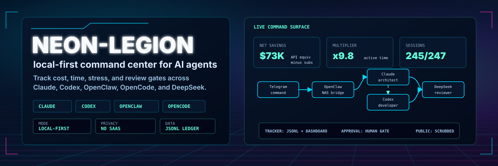
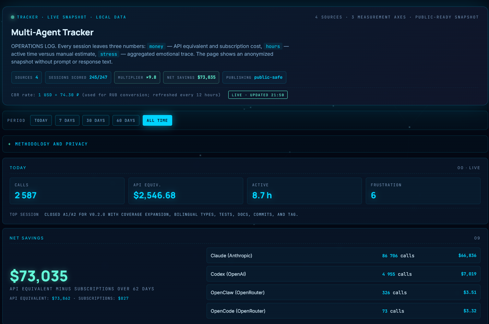
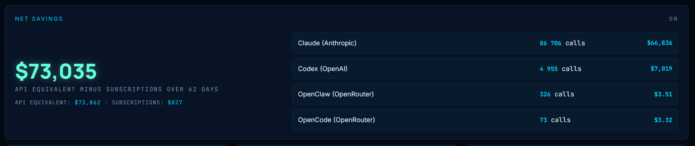
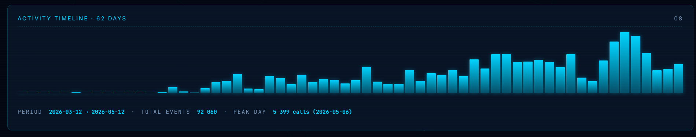
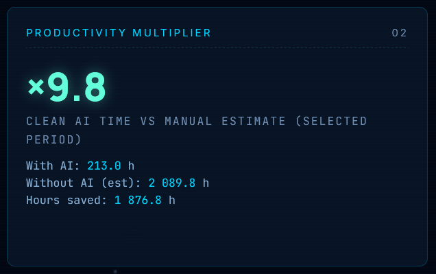
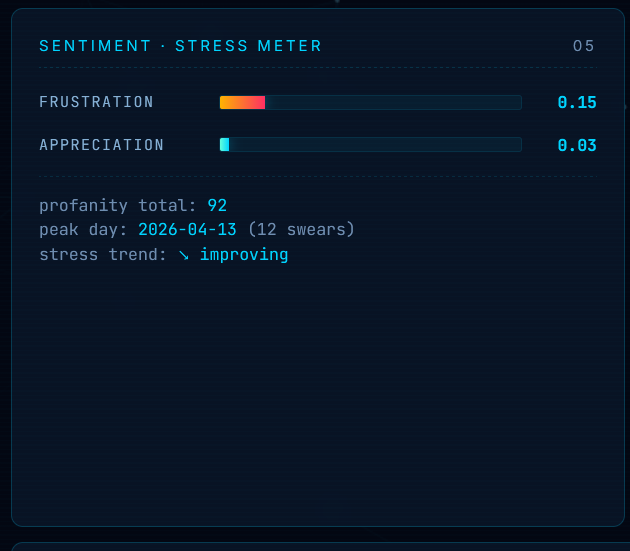
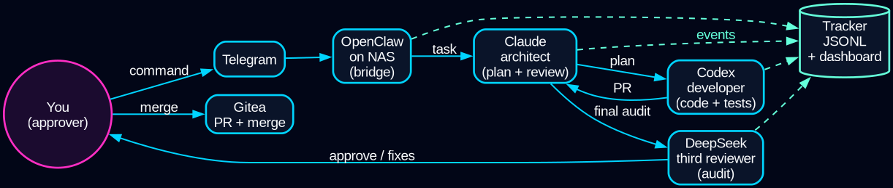
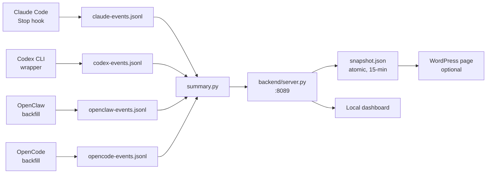
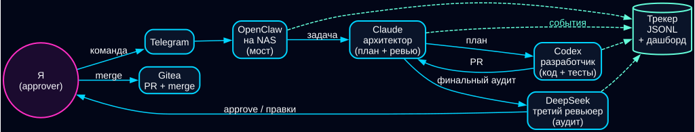

# neon-legion



> **Your personal AI legion. Almost no fucking swearing. _(Yes, we count yours.)_**
>
> Wire up Claude Code, Codex CLI, OpenClaw, OpenCode, and DeepSeek into one
> command-line legion with roles (architect / developer / reviewer /
> approver), cross-machine bridges, and a side-effect cyberpunk dashboard
> that proves it worked. Local-first. No telemetry. No SaaS. No outbound
> calls.

Yes, the name is on purpose. AI is allegedly your army. Mine spent a week
sitting in a corner while I figured out how to count what it cost me.
This tool is what came out of that.

[](LICENSE)


[](docs/architecture.md)



*Local cyberpunk dashboard at 127.0.0.1:8089. Numbers are real
(personal usage, two months of Claude Code + Codex CLI + OpenClaw + OpenCode).*

<!-- START_STATS -->

**Past 163 days from the author's local instance** (`2026-03-09` → `2026-08-18`)

- **304,792 AI calls** across Claude Code + Codex CLI + OpenClaw + OpenCode
- **$102,758 saved** vs equivalent API rate (API would cost $104,931, subscriptions cost a fraction)
- **×5.28 productivity multiplier** — 3,804 human-hours of work compressed
- **Sentiment markers:** 54 thanks / 263 swears — ratio 0:1, mostly happy
- **Most stressed day:** 2026-05-09 (23 frustrated mentions — yes, we count them)
- **Most grateful day:** 2026-05-02 (12 positive markers — we count those too)

_Numbers refresh whenever the snapshot writer runs. Your mileage will vary; see the [dashboard](docs/screenshots/hero.png) for what it looks like locally._

<!-- END_STATS -->

---

## v0.3 highlights

**Hindsight Replay.** Completed orchestrator runs can get a second-model review
with [`tools/hindsight.py`](tools/hindsight.py): Codex output can be critiqued
by OpenCode/DeepSeek, OpenCode output by Codex, and trivial deliverables are
skipped instead of padded.

**Release privacy gate.** [`tools/release-gate.py`](tools/release-gate.py) is a
read-only hard gate for public releases. It scans tracked files, forced ignored
files, and recent commit messages for private data patterns and exits non-zero
on configured failures.

**Demo data.** [`tools/gen-fake-events.py`](tools/gen-fake-events.py) creates
deterministic local telemetry for Claude, Codex, OpenClaw, and OpenCode. The
`make demo` target writes that data and produces `dashboard/snapshot.json` for
an instant dashboard run.

**Schema versioning.** Persisted records now carry `schema_version`, and
[`tools/schema_migrate.py --check`](tools/schema_migrate.py) reports coverage
across tracker JSONL, orchestrator state, and dashboard snapshots.

**Live OpenCode tracking.** [`tracker/opencode-watch.py`](tracker/opencode-watch.py)
polls the OpenCode SQLite database and reuses the idempotent backfill importer.
It logs only non-empty ticks unless `--verbose` is set.

**Tests.** The core suite is 53 stdlib `unittest` cases across orchestrator,
adapter, hindsight, and sanitizer behavior. Run it with
`python -m unittest discover -s tests -v`; see [tests/README.md](tests/README.md).

**Config as TOML.** [`tools/config.py`](tools/config.py) merges
`config.example.toml`, ignored `config.toml`, and explicit env-var overrides.
Backend, tracker, and tool code use it for shared runtime settings without
making local paths part of git history.

## Gallery

| Widget | Shot |
|---|---|
| Period totals — 2 months in one panel |  |
| Cost timeline by provider |  |
| Productivity multiplier (×N big-number) |  |
| Stress overlay — profanity + frustration arc |  |

Agent conveyor (what gets wired up — Telegram → OpenClaw → Claude → Codex → DeepSeek → approve):



## Why

Anyone running both **Claude Max + ChatGPT Pro** is paying ~$400/mo for AI
help. You feel the bill but you can't see the work it's doing. Existing
trackers either lock you into a SaaS, only support one vendor, or focus on
token math instead of "did this actually save me time?"

`neon-legion` answers three questions on one page:

| Axis | Question | How |
|---|---|---|
| **💰 money** | What would API-only have cost? | Per-event cost from real token counts at API rates |
| **⏱ hours** | How long would this have taken without AI? | LLM oracle (Codex / Claude / DeepSeek) estimates per-session human-time baseline |
| **🌡 stress** | How rough was it? | Profanity counter + frustration/appreciation arc from your own messages |

Then it shows you the **multiplier**: `1 + saved/with-AI`. Real number from
real sessions, not aspirational marketing.

And yes, the slogan's *"we count yours"* is literal — `tracker/backfill-profanity.py`
runs a regex on your own messages and writes `profanity_count` to every event.
The number rolls up into the stress axis above. The joke is the feature.

## How it stays private

- **Stdlib only** for `tracker/`, `backend/`, `dashboard/`. No third-party
  packages talking to the network.
- **Local backend** on `127.0.0.1:8089`. The only writer is an atomic
  snapshot file you control.
- **`--public` mode** for the snapshot writer: hashes session IDs with a
  local salt, scrubs paths/emails/tokens/customer-names. Run
  `tools/privacy-scan-snapshot.py` to verify before publishing.
- Per-event JSONL files (`tracker/*-events.jsonl`) live in your repo,
  gitignored. You can `cat` them, you can delete them, you can grep them.

See [SECURITY.md](SECURITY.md) for the threat model.

## Architecture (one picture)



Full diagram + per-layer details: [docs/architecture.md](docs/architecture.md).

## Quick start

```bash
# 1. Clone
git clone https://github.com/andromanpro/neon-legion.git
cd neon-legion

# 2. Register the Claude Code hooks
#    Merge this into ~/.claude/settings.json (replace <PROJECT_ROOT>
#    with the absolute path you just cloned into):
#
#    "hooks": {
#      "Stop": [{"hooks":[{"type":"command",
#        "command":"py -3.14 \"<PROJECT_ROOT>/hooks/claude-track-calls.py\""}]}],
#      "SessionStart": [{"hooks":[{"type":"command",
#        "command":"py -3.14 \"<PROJECT_ROOT>/hooks/claude-session-start.py\""}]}]
#    }
#
#    (install.py helper to register this for you is on the v0.2 roadmap.)

# 3. Wrap Codex CLI calls so they get tracked too
alias codex='python tracker/codex-track.py'

# 4. Start the backend (HTTP API + atomic snapshot writer)
python backend/server.py --snapshot-path dashboard/snapshot.json

# 5. Open the dashboard
open dashboard/index.html
```

Use Claude Code / Codex CLI as normal — events accumulate in
`tracker/*-events.jsonl`, the dashboard auto-refreshes.

> **Config file.** `config.example.toml` documents every override (paths,
> subscription costs, oracle provider). A real config loader is on the
> v0.2 roadmap; for now pass overrides as CLI flags to `backend/server.py`.

## Roles + orchestrator (v0.2)

`neon-legion` ships a thin orchestration layer:

1. Copy `roles.example.toml` → `roles.toml` (gitignored). Edit provider/model
   per role. Out of the box: Claude as architect, Codex as developer,
   DeepSeek as reviewer, you as approver.
2. Copy `prompts/MANIFEST.example.toml` → `your_task.toml`. Describe the
   task. Pick the flow (default: architect → developer → reviewer → approver).
3. Run: `py tools/orchestrate.py run your_task.toml`

Each role's output lands in `orchestrate-runs/<run-id>/`. Human-relay roles
(approver, or any model that hits an OAuth wall) pause the flow — you fill
the answer file, then `py tools/orchestrate.py resume <run-id>` picks it up.

The orchestrator is single-shot, stateless, file-driven. No daemon, no
scheduler, no database. It aligns with the rest of the project: stdlib only,
local-first, no SaaS.

## Features

- **Multi-vendor aggregation** — Claude, Codex, OpenClaw, OpenCode in one
  view, with per-provider breakdown
- **Productivity oracle** — Codex CLI (or Claude when its OAuth refresh
  works) estimates "human-time without AI" per session
- **Sentiment overlay** — frustration / appreciation / profanity per
  session; identifies your "worst day" automatically
- **5-hour rate-limit gauge** — for Anthropic Max subscribers, see how
  close you are to the rolling window cap (cache reads excluded, per
  official rate-limit docs)
- **Period filter** — today / 7d / 30d / 60d / all-time, with sane
  semantics (today = since midnight, not 24h sliding)
- **Bilingual UI** — Russian + English, with RUB currency conversion via
  cbr-xml-daily
- **Snapshot pipeline** — publish aggregated metrics to a WordPress page
  on a NAS / VPS without opening any port
- **Multi-agent SDLC** — built-in patterns for delegating implementation
  to Codex while keeping architecture / review with Claude (see
  [`/multi-agent` skill](https://github.com/andromanpro/claude-skills))

## Comparison

| Tool | Multi-vendor | Sentiment | Self-host | Open source | Cost-aware |
|---|---|---|---|---|---|
| `neon-legion` (this) | ✅ 4 providers | ✅ unique | ✅ | ✅ MIT | ✅ |
| ccusage | Claude only | ❌ | ✅ | ✅ MIT | ✅ |
| WakaTime AI | 15+ tools | ❌ | ❌ ($14/mo) | partial | ✅ |
| Claude Usage Tracker (PH) | Claude only | ❌ | ✅ | ✅ | ✅ |
| Langfuse (B2B) | many | ❌ | ✅ | ✅ AGPL | ✅ |
| Helicone | many | ❌ | ✅ | ✅ Apache | ✅ |

We don't compete with B2B observability platforms — they target teams.
This is built for one developer who wants to know how their AI bill maps
to actual saved hours.

## Roadmap

| Phase | What | Status |
|---|---|---|
| 1.0 | Claude Code event tracking | ✅ |
| 1.0.1 | Retroactive backfill from `~/.claude/projects/` | ✅ |
| 1.1 | Codex CLI tracking wrapper | ✅ |
| 1.2 | OpenClaw / OpenCode tracking | ✅ |
| 1.3 | Productivity oracle (LLM time estimation) | ✅ |
| 1.4 | Sentiment / profanity tracking | ✅ |
| 2 | Aggregator backend + HTTP API | ✅ |
| 3 | Local cyberpunk dashboard | ✅ |
| 3.5 | Snapshot pipeline → WordPress | ✅ |
| 4 | Public stats page (template included) | ✅ |
| 5 | Conversation graph viz (human ↔ AI as graph) | planned |
| 6 | AR overlay (Xreal/Quest agent HUD) | sci-fi |
| 7 | Productization research | research |

## Contributing

See [CONTRIBUTING.md](CONTRIBUTING.md) for how to add a new AI provider,
a third-opinion reviewer (DeepSeek via OpenCode), or a new dashboard
widget. Multi-agent SDLC patterns live in the
[`/multi-agent` skill](https://github.com/andromanpro/claude-skills/tree/main/multi-agent).

## License

MIT — see [LICENSE](LICENSE). Use it, fork it, sell whatever you build
on top. Just don't redistribute the snapshot of someone else's AI
sessions without their explicit consent.

---

# 🇷🇺 По-русски

# neon-legion — твоя личная армия. Почти без ебать-колотить. (Да, мы считаем маты.)

Связывает **Claude Code + Codex CLI + OpenClaw + OpenCode + DeepSeek** в
один командный пункт с ролями (architect / developer / reviewer / approver),
кросс-машинными мостами и побочным киберпанк-дашбордом, который доказывает
что всё это работает. Локально. Без телеметрии, SaaS и outbound-вызовов.

Да, название — это шутка. AI типа твоя армия. Моя у меня неделю просидела
в углу пока я разбирался как сосчитать что она стоила. Этот тул — то, что
из этого вышло.

### Конвейер агентов

Что связывается в один процесс: Telegram → OpenClaw → Claude → Codex →
DeepSeek → human approve. События каждого шага оседают в локальный JSONL
трекер и затем попадают на дашборд.



### Что делает

Связывает агентов и шпионит за ними. Три цифры на дашборде:

- 💰 **деньги** — сколько ты бы заплатил по API без подписок
- ⏱ **часы** — сколько бы делал руками
- 🌡 **мат** — реально считает матерные слова в твоих сообщениях. Сейчас
  у меня 91 за 62 дня, и я не горжусь

### Чем не похож на остальные

Существующие трекеры — закрытые SaaS, поддерживают одного вендора, либо
считают токены вместо «реально ли это сэкономило мне время». Тут четыре
вендора, оркестрация ролей, мост Codex↔OpenClaw между машинами без
открытых портов, и встроенный счётчик матов. Зачем — см. предыдущий пункт.

### Как держим приватность

- **Только stdlib** в `tracker/` / `backend/` / `dashboard/` — никаких
  сторонних пакетов которые ходят в сеть
- **Backend на 127.0.0.1:8089** — наружу не торчит
- **Режим `--public`** перед публикацией: salt-hash session ID, scrub
  путей/email/токенов/имён клиентов
- **JSONL-файлы локально** — `cat`-абельные, удаляемые, по умолчанию
  gitignored

См. [SECURITY.md](SECURITY.md) для threat model.

### Быстрый старт

```bash
git clone https://github.com/andromanpro/neon-legion.git
cd neon-legion
cp config.example.toml config.toml
$EDITOR config.toml

alias codex='python tracker/codex-track.py'
python backend/server.py --snapshot-path dashboard/snapshot.json
# открой dashboard/index.html
```

### Роли + оркестратор (v0.2)

В `neon-legion` есть тонкий слой оркестрации:

1. Скопируй `roles.example.toml` → `roles.toml` (gitignored). Настрой
   provider/model для каждой роли. По умолчанию: Claude как architect,
   Codex как developer, DeepSeek как reviewer, ты как approver.
2. Скопируй `prompts/MANIFEST.example.toml` → `your_task.toml`. Опиши
   задачу и выбери flow (по умолчанию: architect → developer → reviewer
   → approver).
3. Запусти: `py tools/orchestrate.py run your_task.toml`

Выход каждой роли сохраняется в `orchestrate-runs/<run-id>/`. Human-relay
роли (approver или модель, упершаяся в OAuth) ставят flow на паузу: кладёшь
ответ в нужный `.md` файл, затем `py tools/orchestrate.py resume <run-id>`
продолжает выполнение.

Оркестратор одноразовый, файловый и без состояния вне run-директории. Без
демона, scheduler'а и базы данных. Как и остальной проект: stdlib only,
local-first, без SaaS.

### Что внутри

| Слой | Что |
|---|---|
| Hooks / wrappers | Перехватывают события 4-х AI-CLI |
| `tracker/*-events.jsonl` | Append-only события |
| `tracker/summary.py` | Агрегатор, читает все провайдеры |
| `backend/server.py` | HTTP API + snapshot writer (atomic, каждые 15 мин) |
| `dashboard/index.html` | Локальный киберпанк-дашборд (один файл, без сборки) |
| `dashboard/page-multi-agent.php` | Шаблон WordPress-страницы |
| `tools/openclaw-codex-bridge.py` | Опц. cross-machine bridge: OpenClaw на NAS → Codex на Windows |

Полная архитектура: [docs/architecture.ru.md](docs/architecture.ru.md).

### Лицензия

MIT — [LICENSE](LICENSE). Форкай, переделывай, продавай надстройки.
Только не публикуй чужие AI-сессии без их согласия.

---

🌐 [androman.pro](https://androman.pro) · ✈ [Telegram](https://t.me/andromanpro1c)
