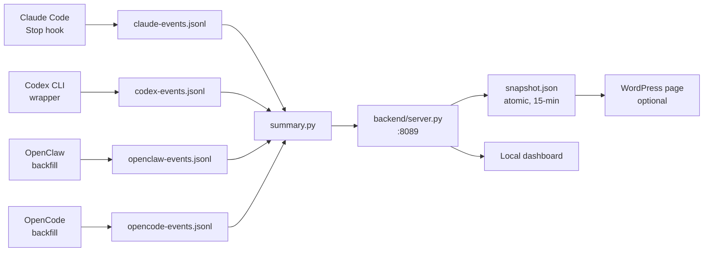

# ai-ops-journal · multi-agent

> **Operational journal for personal AI usage.**
> Tracks the money, hours, and stress that AI saves you across
> Claude Code, Codex CLI, OpenClaw, and OpenCode — in one local-first
> cyberpunk dashboard. No telemetry. No SaaS. No outbound calls.

[](LICENSE)


[](docs/architecture.md)

<!-- Screenshot placeholder. After running the dashboard for a few sessions,
     take a hero shot at 1200×630 and drop it as `docs/screenshots/hero.png`,
     then uncomment the line below.

*(local cyberpunk dashboard — replace with your own screenshot)*
-->

> 📸 **Screenshot coming soon.** After running the dashboard you can drop
> a hero image at `docs/screenshots/hero.png` — README auto-renders it.

---

## Why

Anyone running both **Claude Max + ChatGPT Pro** is paying ~$400/mo for AI
help. You feel the bill but you can't see the work it's doing. Existing
trackers either lock you into a SaaS, only support one vendor, or focus on
token math instead of "did this actually save me time?"

`ai-ops-journal` answers three questions on one page:

| Axis | Question | How |
|---|---|---|
| **💰 money** | What would API-only have cost? | Per-event cost from real token counts at API rates |
| **⏱ hours** | How long would this have taken without AI? | LLM oracle (Codex / Claude / DeepSeek) estimates per-session human-time baseline |
| **🌡 stress** | How rough was it? | Profanity counter + frustration/appreciation arc from your own messages |

Then it shows you the **multiplier**: `1 + saved/with-AI`. Real number from
real sessions, not aspirational marketing.

## How it stays private

- **Stdlib only** for `tracker/`, `backend/`, `dashboard/`. No third-party
  packages talking to the network.
- **Local backend** on `127.0.0.1:8089`. The only writer is an atomic
  snapshot file you control.
- **`--public` mode** for the snapshot writer: hashes session IDs with a
  local salt, scrubs paths/emails/tokens/customer-names. Run
  `tools/privacy-scan-snapshot.py` to verify before publishing.
- Per-event JSONL files (`tracker/*-events.jsonl`) live in your repo,
  gitignored. You can `cat` them, you can delete them, you can grep them.

See [SECURITY.md](SECURITY.md) for the threat model.

## Architecture (one picture)



Full diagram + per-layer details: [docs/architecture.md](docs/architecture.md).

## Quick start

```bash
# 1. Clone
git clone https://github.com/andromanpro/ai-ops-journal.git
cd ai-ops-journal

# 2. Register the Claude Code hooks
#    Merge this into ~/.claude/settings.json (replace <PROJECT_ROOT>
#    with the absolute path you just cloned into):
#
#    "hooks": {
#      "Stop": [{"hooks":[{"type":"command",
#        "command":"py -3.14 \"<PROJECT_ROOT>/hooks/claude-track-calls.py\""}]}],
#      "SessionStart": [{"hooks":[{"type":"command",
#        "command":"py -3.14 \"<PROJECT_ROOT>/hooks/claude-session-start.py\""}]}]
#    }
#
#    (install.py helper to register this for you is on the v0.2 roadmap.)

# 3. Wrap Codex CLI calls so they get tracked too
alias codex='python tracker/codex-track.py'

# 4. Start the backend (HTTP API + atomic snapshot writer)
python backend/server.py --snapshot-path dashboard/snapshot.json

# 5. Open the dashboard
open dashboard/index.html
```

Use Claude Code / Codex CLI as normal — events accumulate in
`tracker/*-events.jsonl`, the dashboard auto-refreshes.

> **Config file.** `config.example.toml` documents every override (paths,
> subscription costs, oracle provider). A real config loader is on the
> v0.2 roadmap; for now pass overrides as CLI flags to `backend/server.py`.

## Features

- **Multi-vendor aggregation** — Claude, Codex, OpenClaw, OpenCode in one
  view, with per-provider breakdown
- **Productivity oracle** — Codex CLI (or Claude when its OAuth refresh
  works) estimates "human-time without AI" per session
- **Sentiment overlay** — frustration / appreciation / profanity per
  session; identifies your "worst day" automatically
- **5-hour rate-limit gauge** — for Anthropic Max subscribers, see how
  close you are to the rolling window cap (cache reads excluded, per
  official rate-limit docs)
- **Period filter** — today / 7d / 30d / 60d / all-time, with sane
  semantics (today = since midnight, not 24h sliding)
- **Bilingual UI** — Russian + English, with RUB currency conversion via
  cbr-xml-daily
- **Snapshot pipeline** — publish aggregated metrics to a WordPress page
  on a NAS / VPS without opening any port
- **Multi-agent SDLC** — built-in patterns for delegating implementation
  to Codex while keeping architecture / review with Claude (see
  [`/multi-agent` skill](https://github.com/andromanpro/claude-skills))

## Comparison

| Tool | Multi-vendor | Sentiment | Self-host | Open source | Cost-aware |
|---|---|---|---|---|---|
| `ai-ops-journal` (this) | ✅ 4 providers | ✅ unique | ✅ | ✅ MIT | ✅ |
| ccusage | Claude only | ❌ | ✅ | ✅ MIT | ✅ |
| WakaTime AI | 15+ tools | ❌ | ❌ ($14/mo) | partial | ✅ |
| Claude Usage Tracker (PH) | Claude only | ❌ | ✅ | ✅ | ✅ |
| Langfuse (B2B) | many | ❌ | ✅ | ✅ AGPL | ✅ |
| Helicone | many | ❌ | ✅ | ✅ Apache | ✅ |

We don't compete with B2B observability platforms — they target teams.
This is built for one developer who wants to know how their AI bill maps
to actual saved hours.

## Roadmap

| Phase | What | Status |
|---|---|---|
| 1.0 | Claude Code event tracking | ✅ |
| 1.0.1 | Retroactive backfill from `~/.claude/projects/` | ✅ |
| 1.1 | Codex CLI tracking wrapper | ✅ |
| 1.2 | OpenClaw / OpenCode tracking | ✅ |
| 1.3 | Productivity oracle (LLM time estimation) | ✅ |
| 1.4 | Sentiment / profanity tracking | ✅ |
| 2 | Aggregator backend + HTTP API | ✅ |
| 3 | Local cyberpunk dashboard | ✅ |
| 3.5 | Snapshot pipeline → WordPress | ✅ |
| 4 | Public stats page (template included) | ✅ |
| 5 | Conversation graph viz (human ↔ AI as graph) | planned |
| 6 | AR overlay (Xreal/Quest agent HUD) | sci-fi |
| 7 | Productization research | research |

## Contributing

See [CONTRIBUTING.md](CONTRIBUTING.md) for how to add a new AI provider,
a third-opinion reviewer (DeepSeek via OpenCode), or a new dashboard
widget. Multi-agent SDLC patterns live in the
[`/multi-agent` skill](https://github.com/andromanpro/claude-skills/tree/main/multi-agent).

## License

MIT — see [LICENSE](LICENSE). Use it, fork it, sell whatever you build
on top. Just don't redistribute the snapshot of someone else's AI
sessions without their explicit consent.

---

# 🇷🇺 По-русски

`ai-ops-journal` — **операционный журнал** для твоей работы с ИИ.

Считает три потери, которые забирает на себя AI:
- 💰 **деньги** — что бы заплатил по API без подписок
- ⏱ **часы** — что бы делал руками
- 🌡 **стресс** — насколько бы ругался в темноту

Поддерживает **Claude Code + Codex CLI + OpenClaw + OpenCode** в одном
киберпанк-дашборде. Всё локально, на `127.0.0.1`. Никакого SaaS, никакой
телеметрии, никаких outbound calls.

### Зачем

Если ты платишь за **Claude Max + ChatGPT Pro** одновременно — это ~$400/мес.
Счёт ты чувствуешь, но **видно ли что AI делает работу за эти деньги**?

Существующие трекеры либо закрытые SaaS, либо поддерживают одного вендора,
либо считают токены вместо «реально ли это сэкономило мне время».

### Как держим приватность

- **Только stdlib** в `tracker/` / `backend/` / `dashboard/` — никаких
  сторонних пакетов которые ходят в сеть
- **Backend на 127.0.0.1:8089** — наружу не торчит
- **Режим `--public`** перед публикацией: salt-hash session ID, scrub
  путей/email/токенов/имён клиентов
- **JSONL-файлы локально** — `cat`-абельные, удаляемые, по умолчанию
  gitignored

См. [SECURITY.md](SECURITY.md) для threat model.

### Быстрый старт

```bash
git clone https://github.com/andromanpro/ai-ops-journal.git
cd ai-ops-journal
cp config.example.toml config.toml
$EDITOR config.toml

alias codex='python tracker/codex-track.py'
python backend/server.py --snapshot-path dashboard/snapshot.json
# открой dashboard/index.html
```

### Что внутри

| Слой | Что |
|---|---|
| Hooks / wrappers | Перехватывают события 4-х AI-CLI |
| `tracker/*-events.jsonl` | Append-only события |
| `tracker/summary.py` | Агрегатор, читает все провайдеры |
| `backend/server.py` | HTTP API + snapshot writer (atomic, каждые 15 мин) |
| `dashboard/index.html` | Локальный киберпанк-дашборд (один файл, без сборки) |
| `dashboard/page-multi-agent.php` | Шаблон WordPress-страницы |
| `tools/openclaw-codex-bridge.py` | Опц. cross-machine bridge: OpenClaw на NAS → Codex на Windows |

Полная архитектура: [docs/architecture.md](docs/architecture.md).

### Лицензия

MIT — [LICENSE](LICENSE). Форкай, переделывай, продавай надстройки.
Только не публикуй чужие AI-сессии без их согласия.
