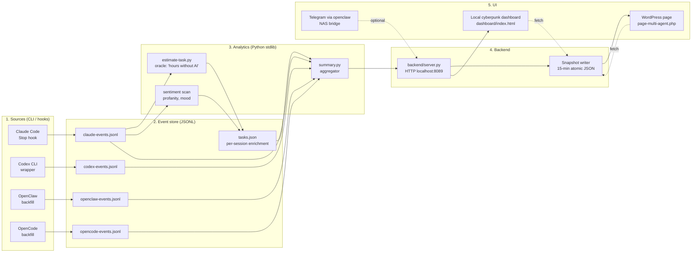

# Architecture

> Русская версия: [architecture.ru.md](architecture.ru.md) — с диаграммой топологии агентов в начале.

`neon-legion` is a 5-layer local-first pipeline. Each layer can run alone;
adding the next layer enables the next class of metrics.

## Data flow (high level)



## Layer 1 — Sources

Each AI provider has its own ingestion path:

| Provider | Method | When events appear |
|---|---|---|
| Claude Code | Stop hook (`hooks/claude-track-calls.py`) | After every assistant turn |
| Codex CLI | wrapper (`tracker/codex-track.py exec ...`) | At end of `codex exec` run |
| OpenClaw | backfill script (manual) | On demand from OpenClaw usage logs |
| OpenCode | backfill script (manual) | On demand from OpenCode usage logs |

All produce **append-only JSONL** with a stable schema (see CONTRIBUTING.md
"Adding a new AI provider tracker").

## Layer 2 — Event store

Plain JSONL files under `tracker/`. No database. Reasons:

- Append-only is simpler than transactional.
- Backup / inspection / replay is `cat`-friendly.
- Each provider's events stay separable — easier to delete a single provider's
  data if needed.

Per-session enrichment lives in `tasks.json`: oracle-estimated
`ai_baseline_hours`, optional user-corrected `human_corrected_hours`,
`profanity_count`, `mood_arc`. Updated by `estimate-task.py` after each
session.

## Layer 3 — Analytics

`tracker/summary.py` is the central aggregator. Read paths:

```
read_events(start, end)
  → read_claude_events + read_codex_events + read_openclaw_events + read_opencode_events
  → tagged with provider, sorted by ts

events_for_task_metrics(events)  → Claude-only (avoid double-counting orchestrator work)
events_for_provider(events, "openai")  → filtered slice
summarize_by_provider(events)  → {provider: stats}
summarize_productivity(events)  → like-with-like: active hours over covered sessions only
```

`tracker/estimate-task.py` calls an LLM (currently Codex CLI, fallback to
Claude when OAuth-refresh works) to estimate "human-time equivalent" per
session. Output goes into `tasks.json`.

## Layer 4 — Backend

`backend/server.py` exposes:

| Endpoint | Returns |
|---|---|
| `/api/health` | uptime, event count, task count |
| `/api/summary?days=N` | totals + by_model |
| `/api/productivity?days=N` | active hours, calendar span, multiplier |
| `/api/sentiment?days=N` | profanity_total, frustration_avg, top_day |
| `/api/budget` | 5h rolling window + 24h |
| `/api/timeseries?metric=cost&days=N` | daily series |
| `/api/sessions?limit=N` | recent sessions with cost/calls/desc |

The same backend also runs a **snapshot writer** in a background thread.
Every `--snapshot-interval` seconds it builds a composite payload (totals,
providers, productivity, budget, sentiment, today, models, sessions,
timeline_weights) and atomically writes it to `--snapshot-path`. Atomic =
write to `*.tmp.<pid>.<tid>` + `os.replace()`.

`--public` mode for snapshot writer:
- Hashes `session_id` with `~/.multi-agent-snapshot-salt` (blake2b-4)
- Scrubs `desc` / `top_session` of paths, emails, tokens, customer names

## Layer 5 — UI

Two display surfaces:

**Local cyberpunk dashboard** (`dashboard/index.html`)
- Single-file HTML + inline CSS + JS, no build step.
- Fetches `/api/*` directly from local backend.
- Live, polls every 30s.

**WordPress page** (`dashboard/page-multi-agent.php`)
- Drop-in WordPress page template.
- Fetches snapshot JSON from same-origin uploads URL.
- Falls back to PHP-baked mock values when snapshot is missing → demo mode.
- Period selector, language switch (RU/EN), RUB currency conversion via
  cbr-xml-daily.

## Optional — OpenClaw bridge

`tools/openclaw-codex-bridge.py` watches an SMB-shared folder
(`<openclaw_share>/codex-bridge/inbox/`) for JSON requests from an OpenClaw
instance running on a NAS. Supports read-only file ops (`list`, `read`,
`rg`, `git_status`), shell-like operations (`handoff_to_codex`), and
sandboxed `codex_exec`.

This is the *cross-machine* edge of the multi-agent design: OpenClaw on
NAS can ask Codex on Windows to execute a task without exposing any port.

## Decisions reference

- **Why JSONL not SQLite**: append-only is trivial, parsing is one regex, no
  schema migrations.
- **Why stdlib only**: dependencies = supply chain risk + install friction
  for hobby users.
- **Why per-provider events files**: easy provider-level delete; easy backup
  per provider; no migration when adding a new provider.
- **Why 15-min snapshot vs websocket push**: snapshot pipeline survives WP
  page being on a different host (NAS) without opening sockets across LAN
  boundaries.
- **Why Codex as oracle, not Claude**: at time of writing, Claude CLI
  headless requires API key (Max-subscription doesn't include API access),
  Codex CLI works headless under ChatGPT-auth.
