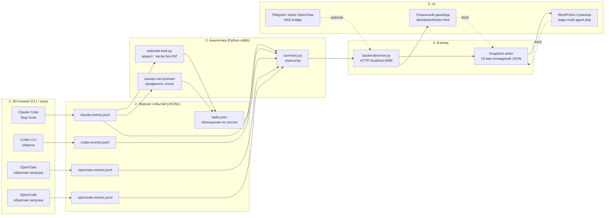

# Архитектура

> English version: [architecture.md](architecture.md).

`neon-legion` — это локальный конвейер из шести слоёв. Каждый слой работает
независимо; добавление следующего открывает следующий класс метрик.

## Топология агентов (Layer 0)

Что было ради чего: связать **трёх ИИ-агентов разных вендоров** в один
управляемый процесс. Трекер появился как побочный результат — нужно было
видеть кто и за что отвечает.


| Роль | Кто | Что делает |
|---|---|---|
| **Architect** | Claude Code | План, режет задачу на куски, ревьюит результат, синтез |
| **Developer** | Codex CLI (gpt-5.5, xhigh reasoning) | Имплементация, тесты, code search |
| **Third-opinion reviewer** | OpenCode + DeepSeek V4-Pro (через OpenRouter) | Финальный аудит, ищет blind spots первых двух |
| **Mobile bridge** | OpenClaw (Docker на NAS) | Принимает команды из Telegram, маршрутизирует на агентов |
| **Approver** | Человек | Merge gate |

Подробнее про роли — [AGENTS.md](../AGENTS.md). Описание моста между
машинами — `tools/openclaw-codex-bridge.py`.

## Поток данных (high level)



## Слой 1 — Источники

У каждого ИИ-провайдера свой путь ингеста:

| Провайдер | Метод | Когда появляется событие |
|---|---|---|
| Claude Code | хук окончания сессии (`hooks/claude-track-calls.py`) | После каждого хода ассистента |
| Codex CLI | обёртка (`tracker/codex-track.py exec ...`) | По завершении `codex exec` |
| OpenClaw | скрипт обратной загрузки | По требованию из логов OpenClaw |
| OpenCode | poll-watcher (`tracker/opencode-watch.py`) | Каждые 30 секунд, тикает по SQLite-БД |

Все пишут **append-only JSONL** со стабильной схемой (см. CONTRIBUTING.md
«Adding a new AI provider tracker»). На каждом событии `schema_version: 1`
— forward-compat для будущих миграций (см. `tools/schema_migrate.py`).

## Слой 2 — Журнал событий

Plain JSONL-файлы в `tracker/`. Без базы данных. Причины:

- Append-only проще транзакционного.
- Бекап, инспекция, replay — через `cat`.
- События каждого провайдера остаются отдельными — легко удалить данные
  одного провайдера без миграции остальных.

Обогащение по сессии живёт в `tasks.json`: оценка оракула
`ai_baseline_hours`, опциональная коррекция пользователем
`human_corrected_hours`, `profanity_count`, `mood_arc`. Пишется
`estimate-task.py` после каждой сессии.

## Слой 3 — Аналитика

`tracker/summary.py` — центральный агрегатор. Пути чтения:

```
read_events(start, end)
  → read_claude_events + read_codex_events + read_openclaw_events + read_opencode_events
  → размечены провайдером, отсортированы по ts

events_for_task_metrics(events)  → только Claude (избегаем двойного учёта при делегировании)
events_for_provider(events, "openai")  → отфильтрованный срез
summarize_by_provider(events)  → {provider: stats}
summarize_productivity(events)  → like-with-like: активные часы только по покрытым сессиям
```

`tracker/estimate-task.py` зовёт LLM (по умолчанию Codex CLI, fallback на
Claude когда OAuth-refresh работает) чтобы оценить «человеческий
эквивалент времени» по сессии. Результат идёт в `tasks.json`.

## Слой 4 — Бэкенд

`backend/server.py` отдаёт:

| Endpoint | Возвращает |
|---|---|
| `/api/health` | uptime, кол-во событий, кол-во задач |
| `/api/summary?days=N` | итоги + by_model |
| `/api/productivity?days=N` | активные часы, календарный охват, множитель |
| `/api/sentiment?days=N` | profanity_total, frustration_avg, top_day |
| `/api/budget` | rolling 5h + 24h |
| `/api/timeseries?metric=cost&days=N` | дневной ряд |
| `/api/sessions?limit=N` | последние сессии с cost/calls/desc |

Тот же бэкенд параллельно крутит **snapshot writer** в фоновом потоке.
Каждые `--snapshot-interval` секунд собирает композитный payload (итоги,
провайдеры, продуктивность, бюджет, sentiment, today, models, sessions,
timeline_weights) и атомарно пишет в `--snapshot-path`. Атомарно =
запись в `*.tmp.<pid>.<tid>` + `os.replace()`.

Режим `--public` для snapshot writer:
- Хеширует `session_id` солью из `~/.multi-agent-snapshot-salt` (blake2b-4).
- Скрабит `desc` / `top_session` от путей, email'ов, токенов, имён клиентов.

## Слой 5 — UI

Две поверхности отображения:

**Локальный киберпанк-дашборд** (`dashboard/index.html`)
- Single-file HTML + inline CSS + JS, без build-шага.
- Тянет `/api/*` напрямую из локального бэкенда.
- Live, polling каждые 30s.

**WordPress-страница** (`dashboard/page-multi-agent.php`)
- Drop-in template для WordPress-страницы.
- Тянет snapshot JSON из same-origin uploads URL.
- Fallback на PHP-baked mock values когда snapshot отсутствует → demo-режим.
- Селектор периода, переключатель языков (RU/EN), конвертация в RUB через
  cbr-xml-daily.

## Опциональный слой — мост OpenClaw

`tools/openclaw-codex-bridge.py` следит за SMB-папкой
(`<openclaw_share>/codex-bridge/inbox/`) на JSON-запросы из OpenClaw,
работающего на NAS. Поддерживает read-only файловые операции (`list`,
`read`, `rg`, `git_status`), shell-подобные (`handoff_to_codex`), и
sandbox-овый `codex_exec`.

Это **межмашинный** край мульти-агентного дизайна: OpenClaw на NAS может
попросить Codex на Windows выполнить задачу без открытия портов.

Документация bridge-протокола от стороны агента — в [AGENTS.md](../AGENTS.md).

## Decisions reference

- **Почему JSONL а не SQLite**: append-only тривиален, парсинг — одна
  regex, нет schema migrations.
- **Почему stdlib only**: зависимости = supply chain риск + install
  friction для hobby-пользователей.
- **Почему файлы событий по провайдерам**: легко удалить данные одного
  провайдера; легко делать бекап; нет миграции при добавлении нового.
- **Почему 15-мин snapshot вместо websocket push**: snapshot pipeline
  переживает то что WP-страница на другом хосте (NAS) — без сокетов
  через LAN-границы.
- **Почему Codex как оракул, а не Claude**: на момент написания, Claude
  CLI headless требует API key (Max-подписка не включает API-доступ),
  Codex CLI работает headless под ChatGPT-auth.
- **Почему второе и третье ревью** (Claude + DeepSeek): на 5 итерациях
  обкатки DeepSeek независимо находил по 1-3 ошибки которые первые два
  ревьюера прозевали. Стоимость одного DeepSeek-аудита ~$0.0025. Расход
  оправдан стабильно.

## Связанные документы

- [AGENTS.md](../AGENTS.md) — контракт для любого ИИ-агента работающего с репо
- [CLAUDE.md](../CLAUDE.md) — Claude-specific entry point
- [README.md](../README.md) — пользовательская история
- [SECURITY.md](../SECURITY.md) — модель угроз
- [tools/README.md](../tools/README.md) — индекс всех утилит
- [tracker/README.md](../tracker/README.md) — схема событий
- [backend/README.md](../backend/README.md) — backend API
