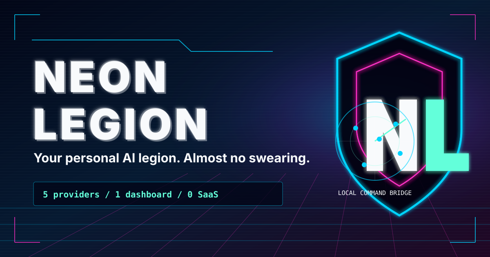
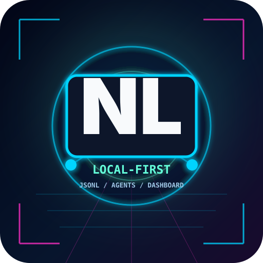
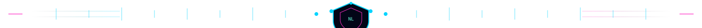
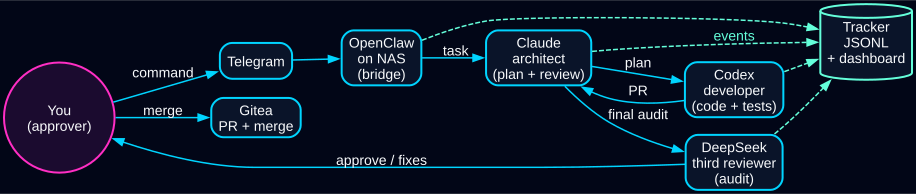

# neon-legion branding kit


This directory contains the vector branding kit for `neon-legion`. The assets are pure SVG: no JavaScript, no external fonts, no external images, and no binary image weight. The visual language is intentionally product-first: local command surface, agent conveyor, privacy gate, and measurable cost/time tracking.

## Assets

| File | Intended use |
|---|---|
| `hero-banner.svg` | README header banner, 1500 x 500. |
| `social-card.svg` | OpenGraph/Twitter/Telegram preview card, 1200 x 630. |
| `logo.svg` | Square avatar and favicon source, 512 x 512. |
| `divider.svg` | Subtle README section divider, 1500 x 72. |
| `neon-legion-flow.dot` / `.svg` | English agent conveyor diagram for the public README. |
| `neon-legion-flow.ru.dot` / `.svg` | Russian agent conveyor diagram for Russian architecture docs. |

## Previews









## Palette

| Color | Role |
|---|---|
| `#020617` | Deep space dark background. |
| `#00D4FF` | Neon cyan primary signal and line work. |
| `#FF2EC4` | Neon magenta accents and warning highlights. |
| `#64FFDA` | Signal green for positive metrics and active state. |
| `#F8FAFC` | Near-white typography and secondary lines. |
| `#7C3AED` | Optional violet glow depth. |

## Swapping Assets

Replace the SVG file in this directory with another self-contained SVG using the same filename. GitHub README links use relative paths, so replacing `hero-banner.svg` or `logo.svg` updates the rendered preview without changing Markdown.

Recommended root README integration:

```md

```

## License

This branding kit is MIT-licensed under the same license as the repository. You may replace, fork, remix, or discard it freely.
